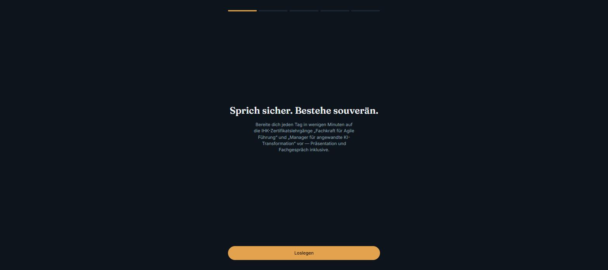
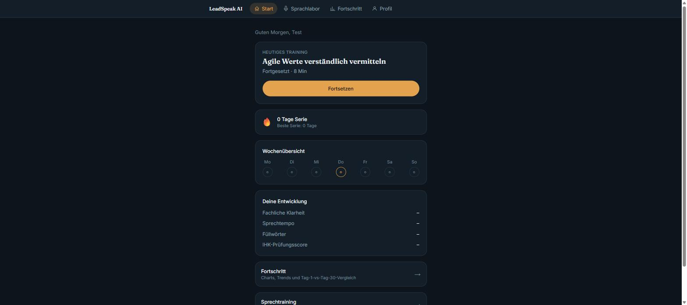
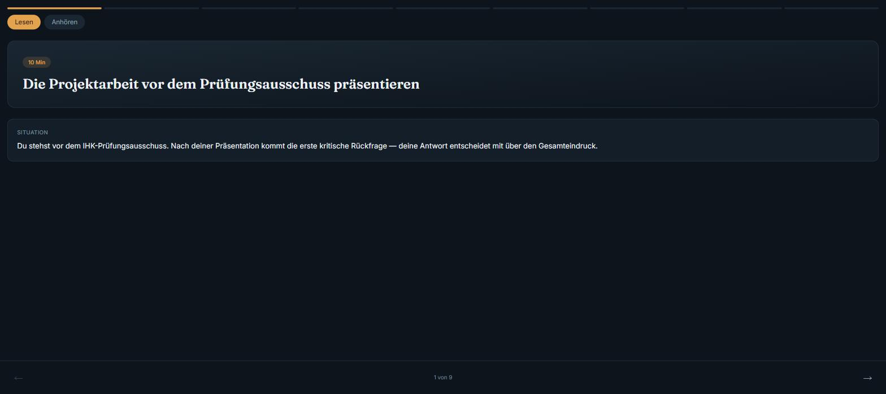
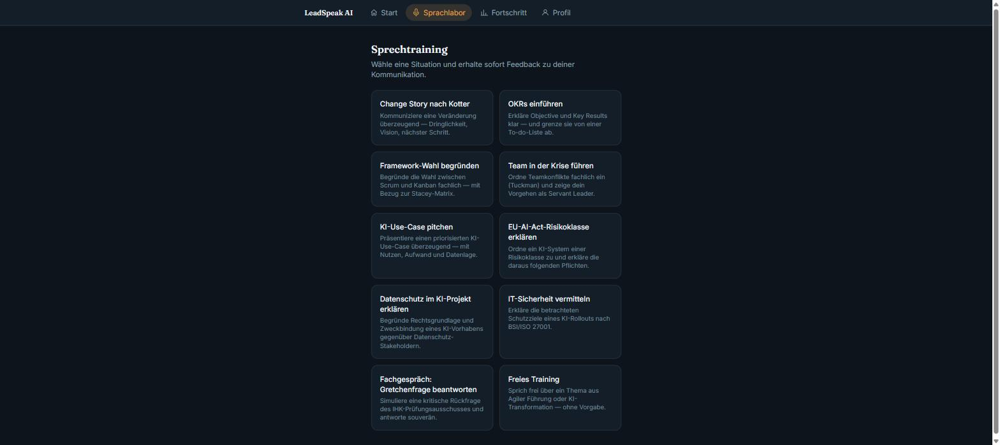

# LeadSpeak AI

**Der Sprechtrainer für die IHK-Zertifikatsprüfung.**

> ℹ️ Dies ist das **öffentliche Präsentations-Repository** von LeadSpeak AI. Es enthält bewusst
> **keinen Quellcode** — nur Konzept, Features und Screenshots. Die Anwendung selbst liegt in
> einem privaten Repository, da LeadSpeak AI ein kommerzielles SaaS-Produkt ist.

---

## Was ist LeadSpeak AI?

LeadSpeak AI ist ein KI-gestützter Prüfungscoach für zwei IHK-Zertifikatslehrgänge:
**„Fachkraft für Agile Führung (IHK)“** und **„Manager für angewandte KI-Transformation (IHK)“**.

Statt Kursinhalte nur zu lesen, sprechen Teilnehmende ihre Antworten auf reale Prüfungssituationen
laut ein — eine kritische Rückfrage im Fachgespräch, eine Stakeholder-Frage zum EU AI Act, die
Verteidigung einer Framework-Wahl — und erhalten in Sekunden strukturiertes KI-Feedback nach
Prüfungskriterien: fachliche Klarheit, Methodenkompetenz, Struktur, Praxistransfer,
Compliance-Bewusstsein, Prüfungsreife und mehr.

**Der Loop:** Lernen → Sprechen → KI-Feedback → Wiederholen → Fortschritt.

Für Unternehmen und Bildungsträger, die Mitarbeitende gezielt auf diese Zertifizierungen
vorbereiten, gibt es zusätzlich ein eigenes B2B-Modell mit Team-Verwaltung.

---

## Live-Demo

**[leadspeak-ai.vercel.app](https://leadspeak-ai.vercel.app)**

Der Link ist live und kann direkt ausprobiert werden — siehe [„Selbst testen“](#für-partner-selbst-testen) weiter unten.

---

## Features

### Der tägliche Lernpfad für Mitarbeitende

Jede Lektion dauert 7–10 Minuten und kombiniert kurze Fachinhalte mit einer praktischen
Sprechübung: Lesen oder Anhören (Text-to-Speech), Lückentext, Flip Cards (Vorher/Nachher),
Quiz — und am Ende eine reale Prüfungssituation, die per Mikrofon eingesprochen und von der KI
bewertet wird. Ein Retry-Vergleich zeigt direkt, wie sich Versuch 2 gegenüber Versuch 1 verbessert
hat, dazu ein persönliches Dashboard mit Trainingsserie und Fortschritts-Charts.

### 10 Lektionen, zwei Zertifikate

**Fachkraft für Agile Führung (IHK)** — 5 Lektionen: Agile Werte & VUCA-Welt, Scrum/Kanban
(inkl. Stacey-Matrix), Teamentwicklung nach Tuckman, OKRs, Change Management nach Kotter/Lewin.

**Manager für angewandte KI-Transformation (IHK)** — 5 Lektionen: KI-Potenzialanalyse, EU AI Act
(Risikoklassen), Datenschutz in KI-Projekten, IT-Sicherheit nach BSI/ISO 27001, und als Abschluss
eine Simulation des Fachgesprächs vor dem Prüfungsausschuss inklusive kritischer „Gretchenfragen“.

### KI-Sprachanalyse nach echten Prüfungskriterien

Jede gesprochene Antwort wird transkribiert, deterministisch vermessen (Sprechtempo, Füllwörter,
Pausen, Satzlänge) und von einem KI-Modell nach neun Dimensionen bewertet: fachliche Klarheit,
Methodenkompetenz, Struktur & Argumentation, Praxistransfer, Compliance-Bewusstsein,
Stakeholder-Perspektive, Prüfungsreife, Kommunikationsstil sowie Reflexion & Verantwortung.

### DSGVO-Consent-System

Da personenbezogene Sprachdaten verarbeitet werden, ist granulare Einwilligung fester Bestandteil
des Produkts — getrennt für Aufnahme/Transkription, KI-Analyse und (im B2B-Kontext) Sichtbarkeit
für den Firmenadmin. Ohne aktive Einwilligung startet keine Aufnahme. Nutzer:innen können jederzeit
alle eigenen Aufnahmen und Transkripte einsehen und löschen (Auskunfts- und Löschrecht).

### B2B: Manager-Dashboard mit Einladungscode

Unternehmen und Bildungsträger können ein Firmenkonto anlegen und erhalten einen Einladungscode,
den Mitarbeitende bei der Registrierung eingeben, um dem Team beizutreten. Im Team-Dashboard sieht
der Firmenadmin Trainingsserie und abgeschlossene Lektionen je Mitglied — aber **nur**, wenn das
jeweilige Mitglied der Sichtbarkeit separat und widerrufbar zugestimmt hat. Firmenzugehörigkeit
allein reicht nicht aus; individuelle Aufnahmen, Transkripte oder Einzel-Scores werden grundsätzlich
nicht an Arbeitgeber weitergegeben.

---

## Screenshots

| Onboarding | Dashboard |
|---|---|
|  |  |

| Lektion | Sprachlabor |
|---|---|
|  |  |

---

## Für Partner: Selbst testen

Die Live-App unterstützt Self-Service-Registrierung — es wird kein gemeinsamer Demo-Zugang
benötigt oder veröffentlicht:

1. **Einzelaccount:** Auf [leadspeak-ai.vercel.app](https://leadspeak-ai.vercel.app) auf
   „Jetzt registrieren“ klicken, ein eigenes Test-Konto anlegen und direkt durch Onboarding,
   eine Lektion und das Sprachlabor gehen.
2. **B2B-Testfirma:** Auf der Login-Seite unten auf „Für dein Team registrieren?“ klicken, ein
   Test-Firmenkonto anlegen — es wird sofort ein Einladungscode angezeigt. Mit einem zweiten
   (Test-)Konto über den Firmencode beitreten, um den kompletten B2B-Flow inklusive
   Team-Dashboard und Einwilligungs-Steuerung selbst zu erleben.

Für eine begleitete Live-Demo gerne direkt Kontakt aufnehmen.

---

*LeadSpeak AI · Konzept & Produktentwicklung*
